# PHPro CRM — Architecture Diagrams

## 1. System Architecture

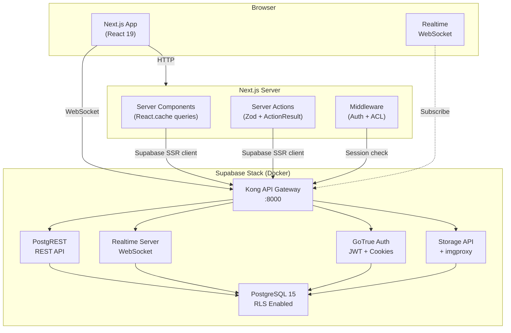

## 2. Entity Relationship Diagram

### 2a. Core CRM

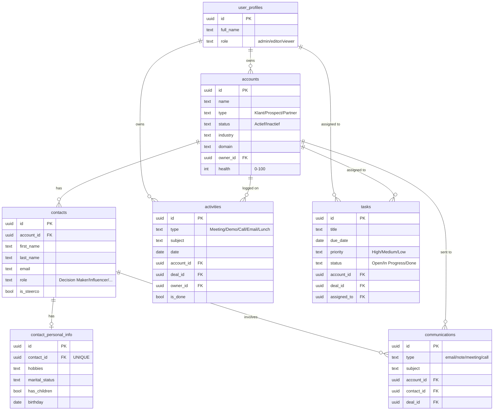

### 2b. Sales Pipeline & Deals

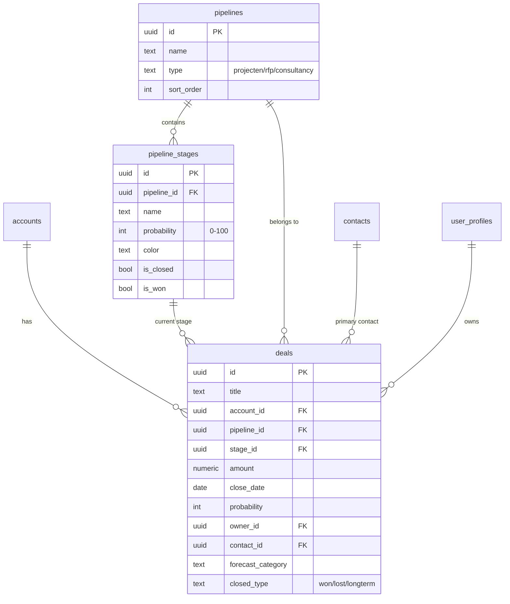

### 2c. Consultants & Bench

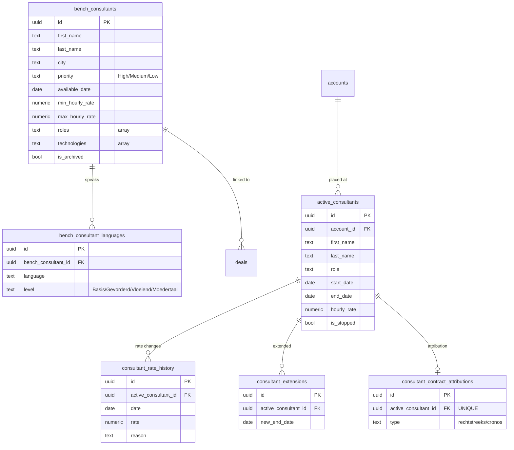

### 2d. Contracts & Finance

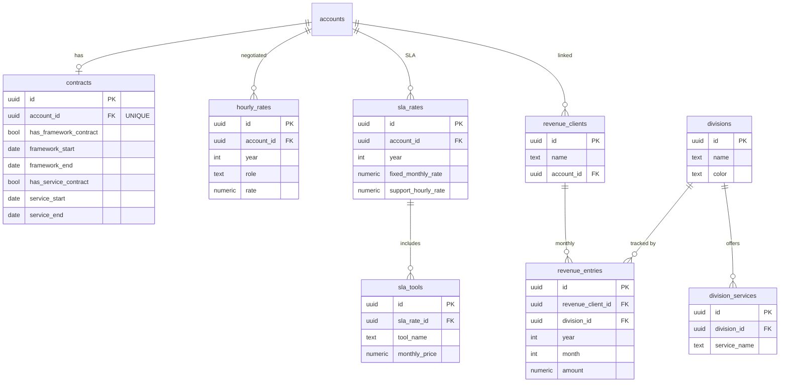

### 2e. HR & Employees

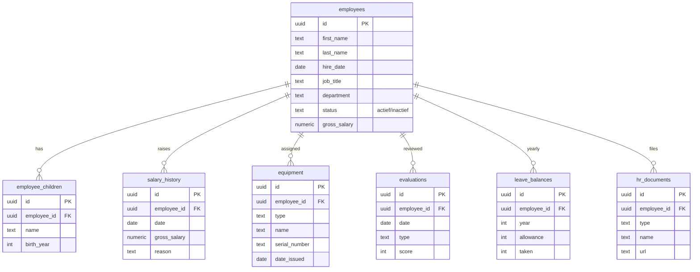

### 2f. Indexation (Rate Adjustment)

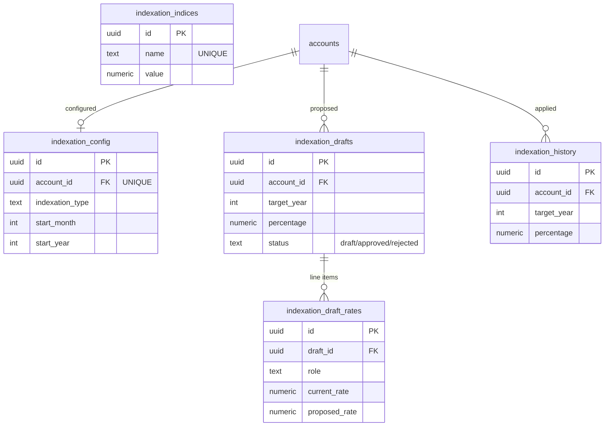

## 3. Deployment Architecture

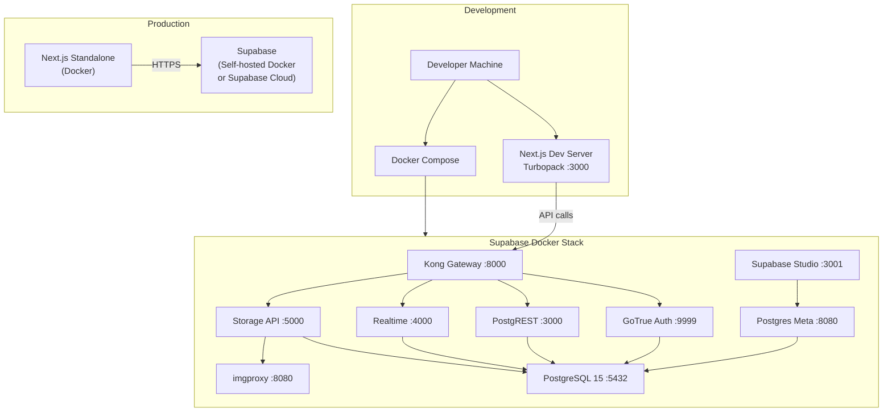

## 4. Feature Module Map

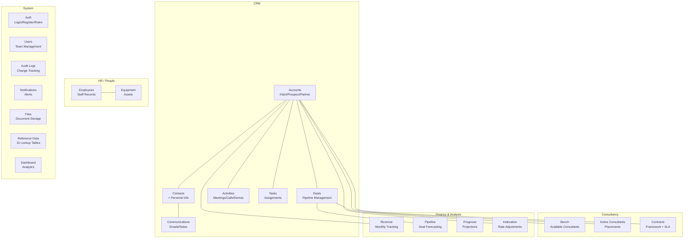

## 5. Data Flow Diagram

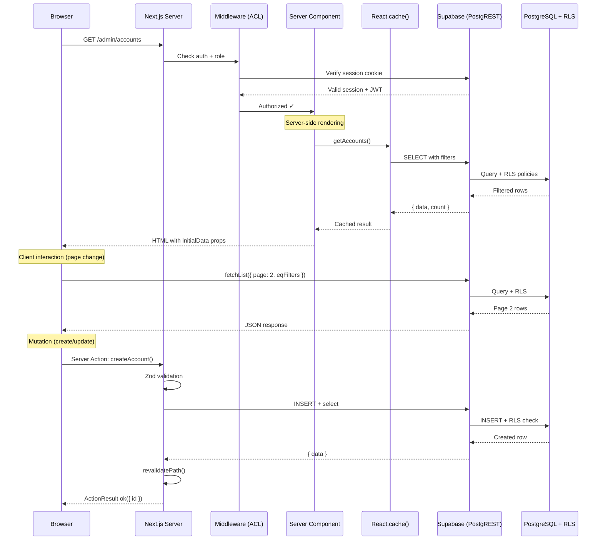

## 6. Security & Auth Flow

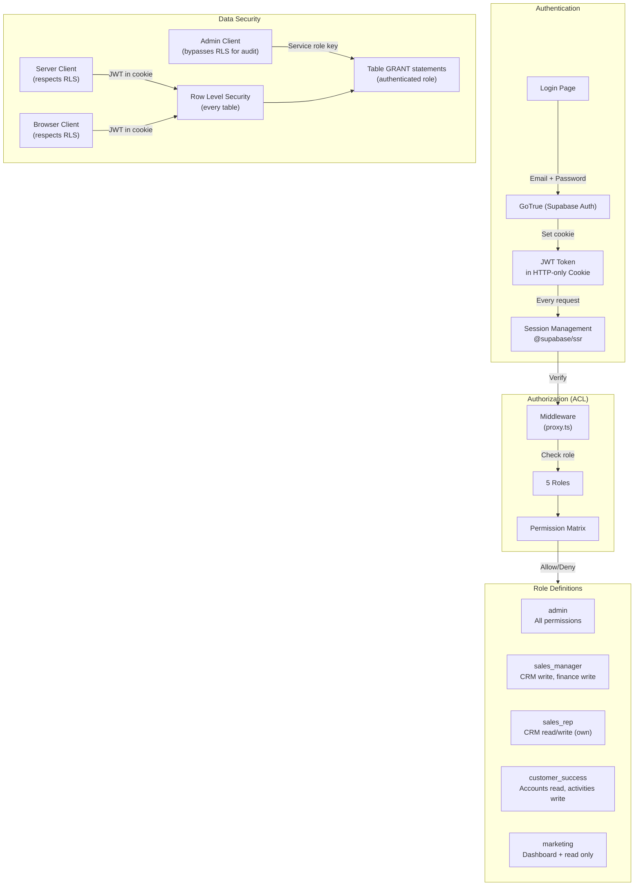
