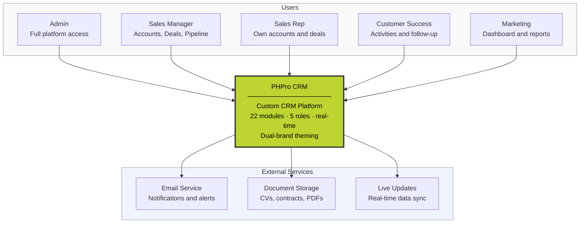
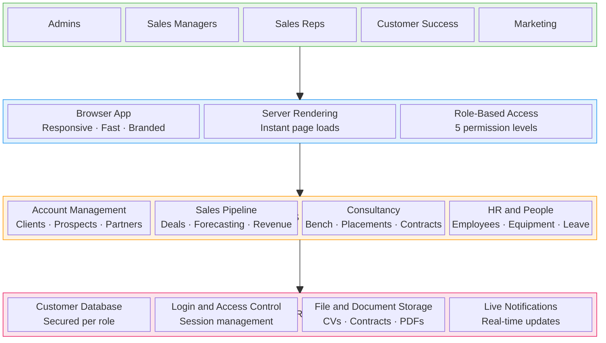
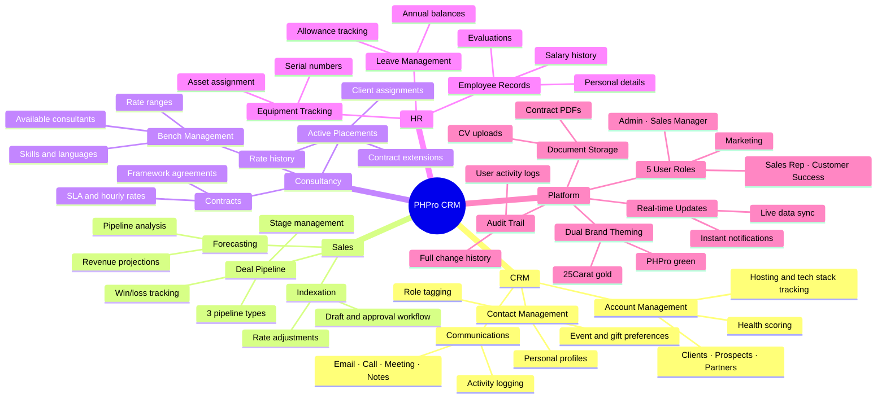
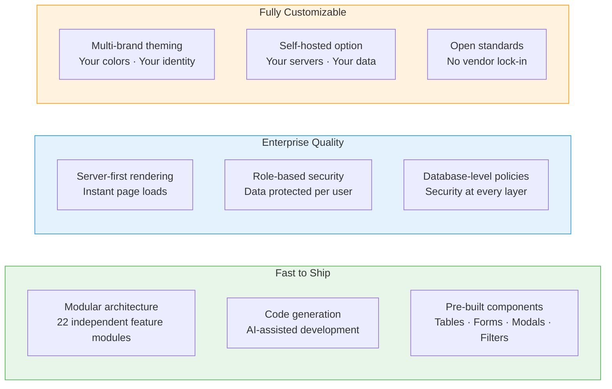

# PHPro CRM — Executive Architecture

## 1. System Context (C4 Level 1)

## 2. Platform Architecture (AKF 4-Layer)

## 3. Feature Scope Overview

## 4. Value Proposition (Technical Differentiators in Business Language)

